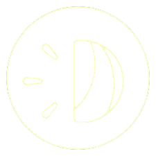
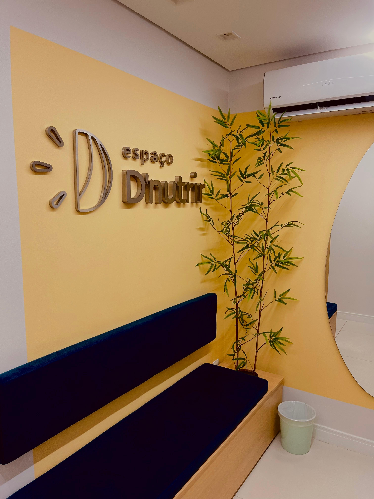
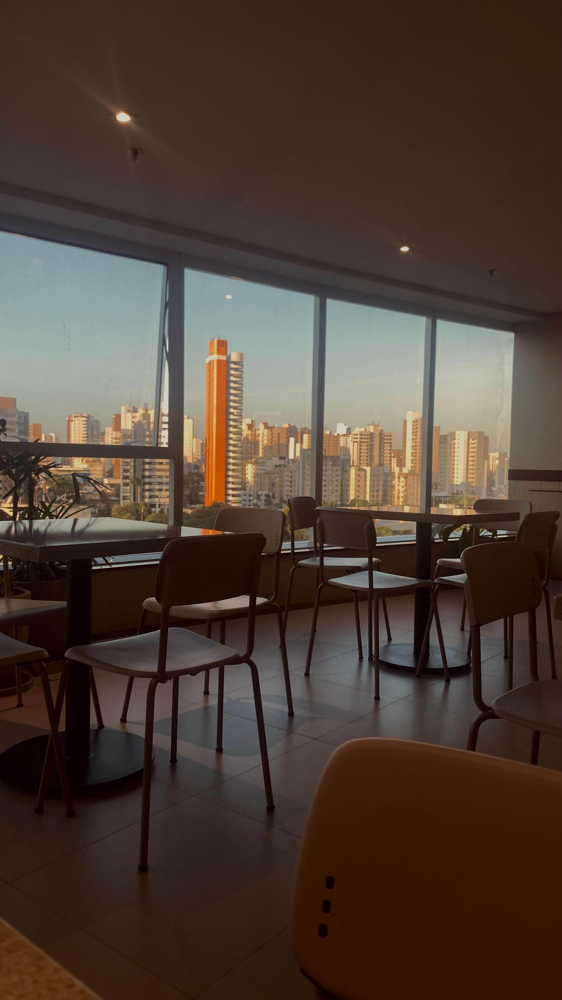

# Espaço D'Nutrir

<p align="center">
  
</p>

Site institucional do **Espaço D'Nutrir**, um coworking voltado a profissionais da saúde em Fortaleza, CE. O projeto apresenta o espaço, planos, Café Científico, localização e canais de contato e agendamento.

## Visão geral

O site é uma landing page estática, leve e responsiva. Não há servidor, banco de dados ou painel administrativo: os contatos e ações de interesse direcionam a pessoa usuária para o WhatsApp, agenda e formulário externo.

<p align="center">
  
</p>

## Recursos

- Navegação por seções com menu responsivo.
- Apresentação do espaço, valores e missão.
- Galeria em carrossel das salas e ambientes.
- Planos, preços e chamadas para agendamento.
- Seção do Café Científico com logo e botão de inscrição.
- Depoimentos em carrossel.
- Mapa integrado e link para rotas no Google Maps.
- Formulário de contato que abre o WhatsApp com a mensagem preenchida.
- Botão flutuante para WhatsApp e link para Instagram no rodapé.

<p align="center">
  
</p>

## Tecnologias

- HTML5
- CSS3
- JavaScript puro
- [Bootstrap 5](https://getbootstrap.com/), para menu, carrosséis e componentes responsivos
- [Font Awesome](https://fontawesome.com/), para ícones
- Google Fonts, para as famílias Inter, Montserrat e Playfair Display

## Estrutura do projeto

```text
Dnutrir/
├── assets/
│   └── img/                    # Logos, fotos e ícones
├── src/
│   ├── js/
│   │   └── app.js              # Links dinâmicos e formulário para WhatsApp
│   └── stylesheet/
│       ├── base.css            # Fontes, cores e regras globais
│       ├── home.css            # Cabeçalho e seção principal
│       ├── sobre.css           # Demais seções e rodapé
│       └── mediaquery.css      # Ajustes para tablet e celular
├── index.html                  # Página principal
└── README.md                   # Documentação do projeto
```

## Como executar

Como o projeto é estático, basta abrir o arquivo `index.html` em um navegador. Para uma experiência mais próxima da publicação, use uma extensão de servidor local do seu editor, como o Live Server no VS Code.

## Configurações importantes

Os links principais ficam em `src/js/app.js`:

```js
const LINK_AGENDA_GOOGLE = "https://linktr.ee/salasdnutrir";
const NUMERO_WHATSAPP = "558599976338";
```

- Atualize `LINK_AGENDA_GOOGLE` para alterar todos os botões de agendamento.
- Atualize `NUMERO_WHATSAPP` com DDI e DDD, sem espaços ou símbolos.
- O botão de inscrição do Café Científico está diretamente no `index.html` e aponta para o formulário do Google.
- O link do Instagram no rodapé também está no `index.html`.

## Responsividade

O layout foi ajustado para três faixas principais:

| Tela                          | Comportamento                                                         |
| ----------------------------- | --------------------------------------------------------------------- |
| Computador e notebook         | Conteúdo em duas colunas quando há espaço disponível.                 |
| Tablet (até 992 px)           | Espaçamentos e tipografia são reduzidos; a capa se adapta ao fundo.   |
| Celular (até 768 px e 576 px) | Conteúdo empilhado, botões em largura total e galerias simplificadas. |

## Publicação

O projeto pode ser publicado em serviços de hospedagem estática, como GitHub Pages, Netlify, Vercel ou a hospedagem do domínio da empresa. Envie o conteúdo da pasta do projeto, mantendo a estrutura de arquivos intacta.

## Créditos

Desenvolvido para o Espaço D'Nutrir. O rodapé do site mantém o crédito de desenvolvimento original.
